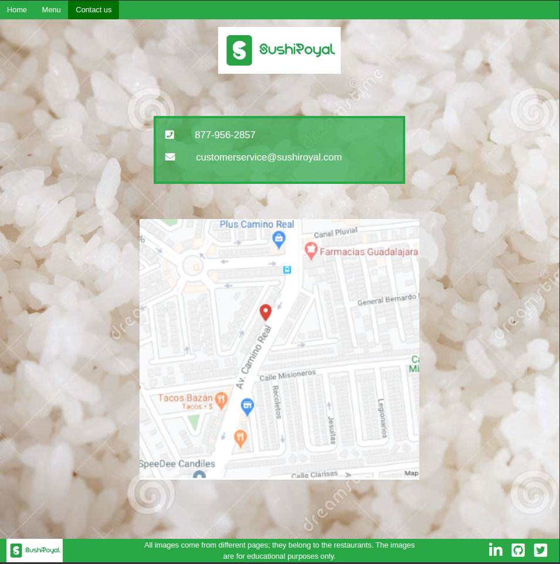

# SushiRoyal website!

SushiRoyal website, for the Sushi lovers. This website was created with Vanilla JavaScript using modules and DOM manipulation. I start with an almost blank HTML file and build every element displayed using JS. We used Webpack 4 to bundle all the different files and modules together to display the website.

## Screenshots




> This project required knowledge of JavaScript with ES6 syntax, Webpack 4 fluency, JS Modules, and basic web development skills. I also used Bootstrap to help with website responsiveness and development.

## Built With

- Javascript
- Webpack 4
- Bootstrap
- CSS3
- HTML5

Tools used on this project

- Visual Studio Code
- Font Awesome

## Instructions to run the project

- Open terminal on your workspace with

```
cd /home/projects_workspace/..
```

- Cloning the project input the next code:

```
git clone git@github.com:lmaldonadoch/restaurant-page.git
```

- Navigate to the folder of the project

```
cd /restaurant-page/
```

Open `index.html` in your web browser

## Live Version

[Hosted on Githack](https://rawcdn.githack.com/lmaldonadoch/restaurant-page/07ba120023706cbc9da0ca70df5e110aab27d251/dist/index.html)

## Authors

👤 **Luis Angel Maldonado Chavez**

- Github: [@lmaldonadoch](https://github.com/lmaldonadoch)
- Twitter: [@LuisAngelMCh](https://twitter.com/LuisAngelMCh)
- Linkedin: [linkedin](https://www.linkedin.com/in/lmaldonadoch)

## Contributing

Contributions, issues and feature requests are welcome!

Feel free to check the [issues](https://github.com/lmaldonadoch/restaurant-page/issues).

## Show your support

Give a ⭐️ if you like this project!

## Acknowledgements

- [Github](http://github.com/).
- [The Odin Project](theodinproject.com/).

## License

This project is [MIT](lic.url) licensed.
